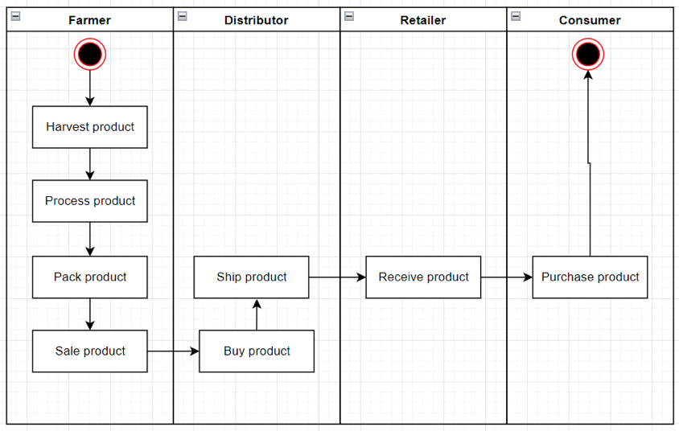
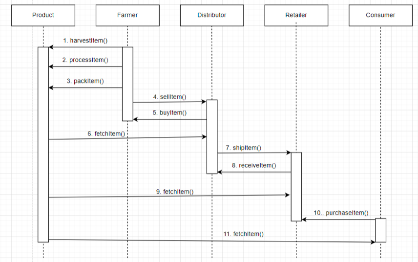
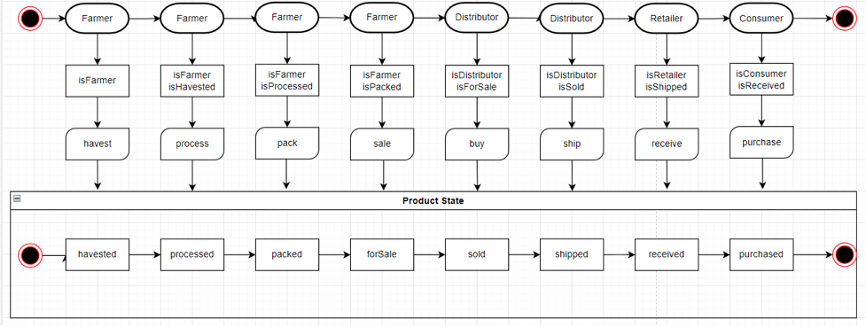
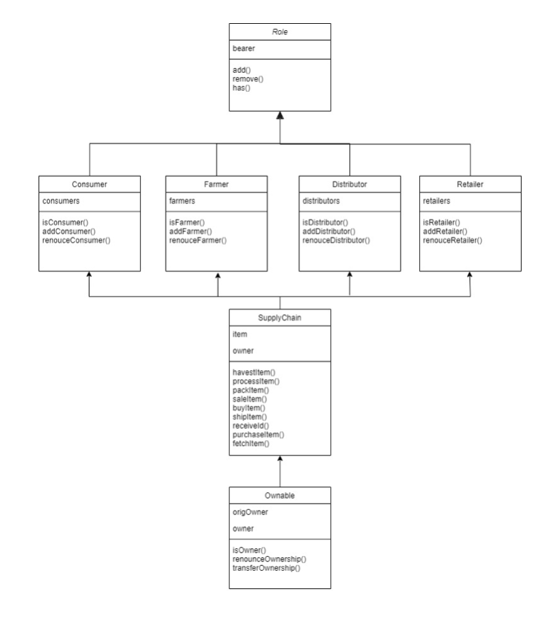

# Supply chain project

This is a project summary for Supply Chain dApp on Ethereum network.

## Libraries used
* `web3` -> main library used for interacting with Web3 and Blockchain
* `openzeppelin-solidity` -> additional library which provides templates of code and standards for tokens
* `truffle-hdwallet-provider` -> to deploy the contract to Ethereum Goerli network

## Versions
* `Program version` -> 1.0.0
* `npm version` -> 8.11.0
* `truffle version` -> 4.1.14
* `Solidity version` -> 0.4.24
* `web3 version` -> 1.8.2

## Deploying to Etherem Goerli network
Run the following command: `truffle migrate --network goerli`  
Transaction hash: `https://goerli.etherscan.io/tx/0x2be76baafbaadff5126a0fbac52e36b56d7e056bf5b752638365ad9321817814`
Contract address: `https://goerli.etherscan.io/address/0xb645306d2cdc1661e7ec049e4419b77f45faf32b`

## UML diagrams
For the project write-up there were 4 diagrams created: activity, sequence, state, class.

### UML Activity

### UML Sequence

### UML State

### UML Class

